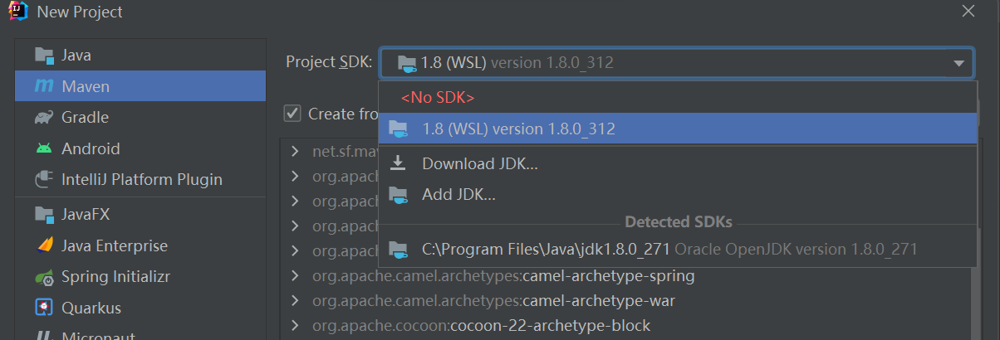
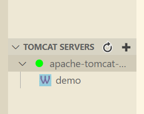
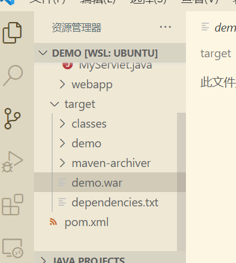

## 安装java,maven

`sudo apt-get update` 更新索引

#### 1.apt安装

`sudo apt install openjdk-8-jdk`安装jdk8

~~`sudo apt install maven`安装maven(idea不认同这个😂)~~

#### 2.手动安装

###### java:

`wget https://mirrors.tuna.tsinghua.edu.cn/AdoptOpenJDK/8/jdk/x64/linux/OpenJDK8U-jdk_x64_linux_hotspot_8u322b06.tar.gz`下载

`tar -zxvf OpenJDK8U-jdk_x64_linux_hotspot_8u322b06.tar.gz /usr/local/java/`  解压到自定义路径

手动安装需要配置环境变量

```
export JAVA_HOME=/usr/local/java/jdk8u322-b06
export JRE_HOME=${JAVA_HOME}/jre
export CLASSPATH=.:${JAVA_HOME}/lib:${JRE_HOME}/lib
export PATH=.:${JAVA_HOME}/bin:$PATH
```

`java -version` 查看安装

###### maven:

`wget https://mirrors.tuna.tsinghua.edu.cn/apache/maven/maven-3/3.8.4/binaries/apache-maven-3.8.4-bin.tar.gz`手动下载maven

`sudo tar -zxvf apache-maven-3.8.4-bin.tar.gz /usr/local/maven`解压到自定义路径

在`~/.zshrc`文件添加以下内容，使其可在zsh下调用(bash用户则修改~/.profile)

```
export M2_HOME=/usr/local/maven/apache-maven-3.8.4
export PATH=${PATH}:${M2_HOME}/bin
```

`mvn -version`查看安装

## 安装tomcat

` wget https://mirrors.tuna.tsinghua.edu.cn/apache/tomcat/tomcat-9/v9.0.58/bin/apache-tomcat-9.0.58.tar.gz` 手动下载tomcat安装包（apt install安装的位置过于分散，试过了，不会搞）

`tar -zxvf apache-tomcat-9.0.58.tar.gz /usr/local/tomcat` 解压安装包到自定义的目录

`sudo chmod -R 777 /usr/local/tomcat/apache-tomcat-9.0.58`给文件夹子文件访问和执行权限

`cd /usr/local/tomcat/apache-tomcat-9.0.58/bin`

`sh startup.sh`执行启动脚本

可在默认8080端口访问到tomcat页面

## 配置maven路径-idea(失败）

## idea2021.2.3仍不支持读取wsl内环境变量)

idea还是很智能的，能自动检测wsl中的jdk



但maven则需要手动修改了，否则用的是idea自己的maven

`ctrl+alt+s`呼出设置，找到maven设置，

修改`maven home path` 为`\\wsl$\Ubuntu\usr\local\maven\...`

`User settings file` 在 `/etc/maven/settings.xml` 有默认配置文件，建议和仓库一起建到用户目录下，如上图所示位置（其实只是我root目录下权限问题搞不定😂）

等idea优化后再写

## 配置code（推荐）

前提，code的话，也只是用调用linux终端运行项目，idea也能做到，提示还不能像idea那么智能，只不过code开的快，且占用小，毕竟都是微软家的东西，相信优化的会比idea更快到来。

安装wsl连接工具`Remote-WSL`

在wsl内安装官方Java扩展插件`Extension pack for java`，下得贼慢，不会处理

使用`ctrl+shift+p`搜索create java就可以创建java项目了

tomcat项目需要安装 `tomcat for java`插件

安装后在code资源管理器可以看到



点击加号添加tomcat路径，如`/usr/local/tomcat/apache-tomcat-9.0.58`,右键该tomcat服务器，选择start，由红变绿（报错的话，可能是端口占用，请先确保原8080端口没有tomcat服务启动），成功后可以在8080看到


在打包好的maven项目



右键demo.war选择run on tomcat server ，即可在8080端口完成部署


## 注意事项

1.由于使用的是linux下的jdk，项目地址也应保存在wsl2的文件目录下，否则可能会报错

