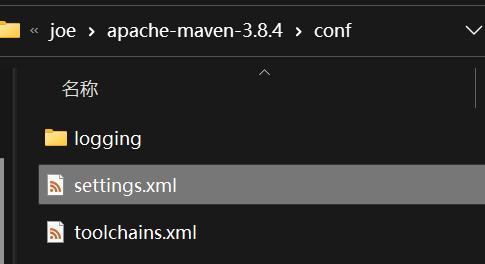
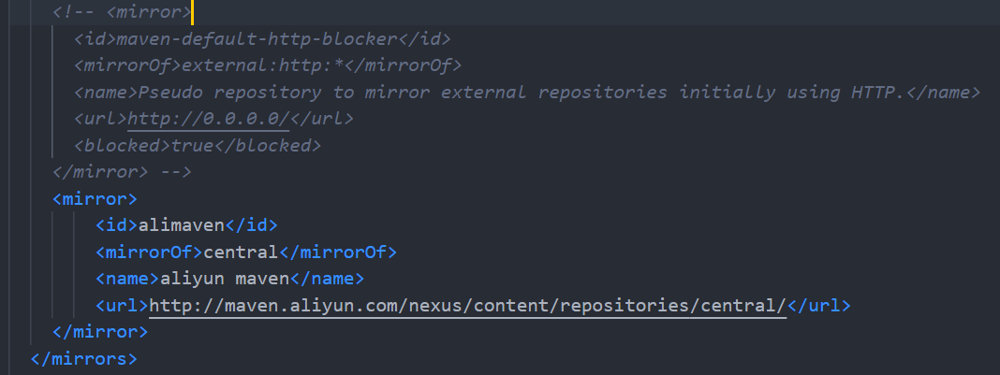
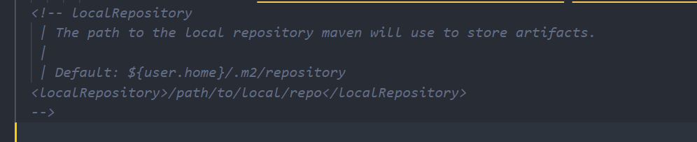

## java

系统属性环境变量：

- 变量名：`JAVA_HOME`

- 变量值:   安装位置

- 变量名：`CLASSPATH`
- 变量值：`.;%JAVA_HOME%\lib\dt.jar;%JAVA_HOME%\lib\tools.jar; `
- 变量名：PATH
- 变量值：`%JAVA_HOME%\bin`   `%JAVA_HOME%\jre\bin`

## maven

系统属性环境变量：

- 变量名：`M2_HOME`

- 变量值:   安装位置

- 变量名：PATH
- 变量值：`%M2_HOME%\bin` 

配置镜像源：



```
<mirror>
    <id>alimaven</id>
    <mirrorOf>central</mirrorOf>
    <name>aliyun maven</name>
    <url>http://maven.aliyun.com/nexus/content/repositories/central/</url>
</mirror>
```

配置本地仓库地址（默认又不是不行）：



修改maven默认jdk版本：


```
<profile>     
    <id>JDK-1.8</id>       
    <activation>       
        <activeByDefault>true</activeByDefault>       
        <jdk>1.8</jdk>       
    </activation>       
    <properties>       
        <maven.compiler.source>1.8</maven.compiler.source>       
        <maven.compiler.target>1.8</maven.compiler.target>       
        <maven.compiler.compilerVersion>1.8</maven.compiler.compilerVersion>       
    </properties>       
</profile>

```

## tomcat

- 变量名：`CATALINA_BASE`

- 变量值：安装位置

- 变量名：`CATALINA_HOME`

- 变量值：安装位置

- 变量名：`Path`

- 变量值：`;%CATALINA_HOME%\lib;%CATALINA_HOME%\bin`


