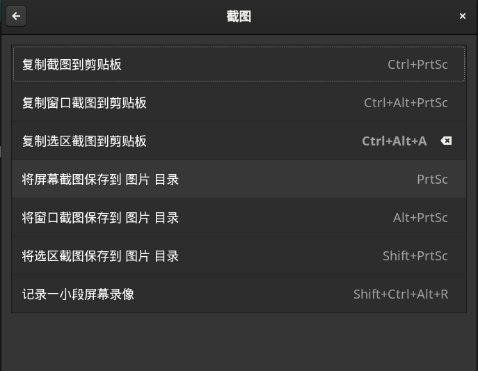
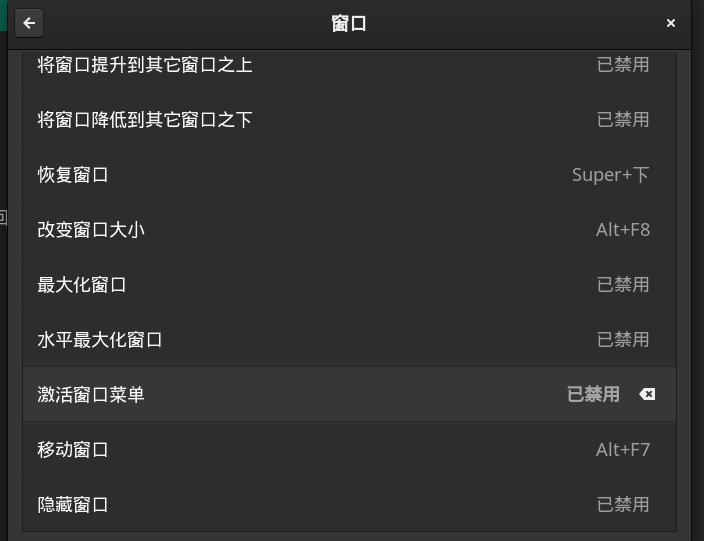

## Manjaro+Gnome 配置

- 下载安装就不bb了

- #### 换源
  ```
  sudo pacman-mirrors -i -c China -m rank
  sudo pacman -Syyu
  ```
  
- #### 下载yay(负责AUR)
  ```
  sudo pamcan-S yay
  ```
  
  /etc/pacman.conf取消color注释打开颜色
  
- #### 中文输入
  ```
  yay -S base-devel
  yay -S fcitx-im fcitx-configtool
  yay -S fcitx-sogoupinyin
  ```
  
  安装完后在/etc/profile加上：
  ```
  export GTK_IM_MODULE=fcitx
  export QT_IM_MODULE=fcitx
  export XMODIFIERS="@im=fcitx"
  ```
  
- #### chrome浏览器
  ```
  yay -S google-chrome
  ```
  
  使用chrome出现密钥环设置，留空就好，反正是个人pc
  
- #### 安装zsh
  
  其实默认就是zsh，没有的话
  ```
  yay -S zsh
  chsh -s `which zsh`
  ```
  
- #### 安装oh-my-zsh
  ```
  cd
  git clone https://github.com/skillf-qf/ohmyzsh.git
  cd ./ohmyzsh/tools/
  ./install.sh
  ```
  
  插件zsh-syntax-highlighting zsh-autosuggestions
  ```
  cd $HOME/.oh-my-zsh/plugins
  git clone https://github.com/zsh-users/zsh-syntax-highlighting.git
  git clone https://github.com/zsh-users/zsh-autosuggestions ${ZSH_CUSTOM:-~/.oh-my-zsh/custom}/plugins/zsh-autosuggestions
  ```
  
  在~/.zshrc文件添加插件，替换主题，再souce一下
  
  ### 办公软件

- #### 安装typora

  官网typora.io需要科学上网，点击链接下载 [typora-0.11.18-1-x86_64.pkg.tar.zst](../typora-0.11.18-1-x86_64.pkg.tar.zst) 

  解压：

  ```
  sudo mkdir /usr/local/typora
  sudo tar -I zstd -xvf typora-0.11.18-1-x86_64.pkg.tar.zst -C /usr/local/typora
  ```

  创建快捷方式：创建一个以下内容的.desktop 文件(可以通过复制已存在的文件，然后修改)。添加到/usr/share/applications

  ```
  [Desktop Entry]
  Name=Typora
  Comment=Typora-0.11.18(beta)
  Exec=/usr/local/typora/usr/bin/typora
  Icon=/usr/local/typora/usr/share/icons/hicolor/128x128/apps/typora.png
  Terminal=false
  Type=Application
  ```

- #### 安装WPS
  ```
  yay -S  wps-office-mui-zh-cn  wps-office-cn
  ```

  会科学上网可以把符号字体补上
  ```
  yay -S ttf-wps-fonts
  ```

- #### 安装utools
  ```
  yay -S utools   
  ```

- #### 安装 pinta
  ```
  yay -S pinta
  ```

  ### 开发工具部分
  > 部分开发工具不需要随版本随包管理器更新，可选择手动安装

- #### VScode
  ```
  yay -S visual-studio-code-bin
  ```

- #### IDEA

  ##### 手动安装（2021.2.4版本）：

  下载：
  ```
  wget https://download.jetbrains.com/idea/ideaIU-2021.2.4.tar.gz\?_gl\=1\*qe1e59\*_ga\*Njg0MDA5NzQuMTY0NTg1MTM5MQ..\*_ga_V0XZL7QHEB\*MTY0NTg1MTM5MC4xLjAuMTY0NTg1MTM5Ni4w\&_ga\=2.151075327.773858133.1645851392-68400974.1645851391
  ```

  解压：
  ```
  sudo mkdir /usr/local/idea
  sudo tar -zxvf 'ideaIU-2021.2.4.tar.gz?_gl=1*qe1e59*_ga*Njg0MDA5NzQuMTY0NTg1MTM5MQ..*_ga_V0XZL7QHEB*MTY0NTg1MTM5MC4xLjAuMTY0NTg1MTM5Ni4w&_ga=2.151075327.773858133.1645851392-68400974.1645851391' -C /usr/local/idea
  ```

  创建快捷方式：
  创建一个以下内容的.desktop 文件添加到/usr/share/applications

  ```desktop
  [Desktop Entry]
  Name=IdeaIU
  Comment=Rayn-IDEA_IU
  Exec=/usr/local/idea/idea-IU-212.5712.43/bin/idea.sh
  Icon=/usr/local/idea/idea-IU-212.5712.43/bin/idea.png
  Terminal=false
  Type=Application
  ```

  最好再去设置里关闭掉更新提醒，以免点到

  ##### yay 安装：

  注意：jre也是必须要下的
  ```
  yay -S intellij-idea-ultimate-edition  
  yay -S intellij-idea-ultimate-edition-jre
  ```

- #### Java

  下载：
  ```
  wget https://mirrors.tuna.tsinghua.edu.cn/AdoptOpenJDK/8/jdk/x64/linux/OpenJDK8U-jdk_x64_linux_hotspot_8u322b06.tar.gz
  ```

  解压：
  ```
  sudo mkdir /usr/local/java
  sudo tar -zxvf OpenJDK8U-jdk_x64_linux_hotspot_8u322b06.tar.gz -C /usr/local/java/
  ```

  添加到/etc/profile:
  ```
  export JAVA_HOME=/usr/local/java/jdk8u322-b06
  export JRE_HOME=${JAVA_HOME}/jre
  export CLASSPATH=.:${JAVA_HOME}/lib:${JRE_HOME}/lib
  export PATH=.:${JAVA_HOME}/bin:$PATH
  ```

  检查：
  ```
  java -version
  ```

- #### Tomcat

  下载：
  ```
  wget https://mirrors.tuna.tsinghua.edu.cn/apache/tomcat/tomcat-9/v9.0.58/bin/apache-tomcat-9.0.58.tar.gz
  ```

  解压：
  ```
  sudo mkdir /usr/local/tomcat
  sudo tar -zxvf apache-tomcat-9.0.58.tar.gz -C /usr/local/tomcat
  ```

  给运行权限：
  ```
  sudo chmod -R 777 /usr/local/tomcat/apache-tomcat-9.0.58
  ```

  输入以下命令后打开浏览器检查本地8080端口：
  ```
  cd /usr/local/tomcat/apache-tomcat-9.0.58/bin
  sh startup.sh
  ```

- #### Maven

  下载:
  ```
  wget https://mirrors.tuna.tsinghua.edu.cn/apache/maven/maven-3/3.8.4/binaries/apache-maven-3.8.4-bin.tar.gz
  ```

  解压：
  ```
  sudo mkdir /usr/local/maven
  sudo tar -zxvf apache-maven-3.8.4-bin.tar.gz  -C /usr/local/maven
  ```

  检查：
  ```
  mvn -version
  ```

  换源：
  ```xml
  <mirror>
    <id>alimaven</id>
    <mirrorOf>central</mirrorOf>
    <name>aliyun maven</name>
    <url>http://maven.aliyun.com/nexus/content/repositories/central/</url>
  </mirror>
  ```

- #### 其他

  时间校准
  ```
  sudo pacman -S ntp && sudo timedatectl set-ntp true
  ```

  输入法设置

  

  

  系统快捷键

  截图（../assets/img/Manjaro+Gnome配置/gnome下截无法使用截图工具截图，只能用自带的）

  

  关闭原alt+space（留给我的utools）

  

  也可以使用系统快捷键来呼出utools，但是那样就只能esc关闭了

  
